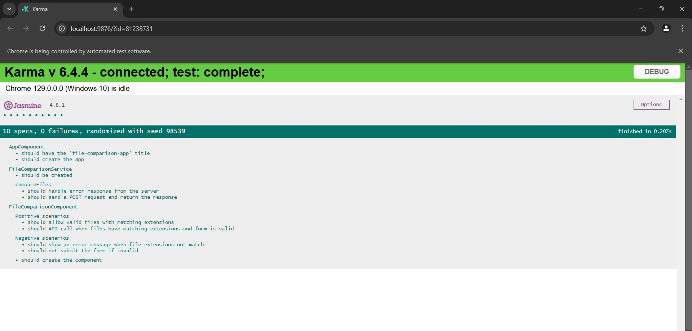

# FileComparator APP

# Backend Setup and running

1. Go to the file-comparision-backend root directory
2. Run the "npm install" command
3. Run the "npm run start" command
4. Running the backend the port no "3000"

# Front-end Setup and Running

1. Ensure that file-comparision-backend app is running
2. Go to the file-comparison-app root directory
3. Run the "npm install" command
4. Run the "npm run start" command
5. Running the frontend the port no "4200"

# Front-end Unit Test case Running

1. Go to the file-comparison-app root directory
2. Run the "npm run test" command
3. You will see the below image test cases:

   
